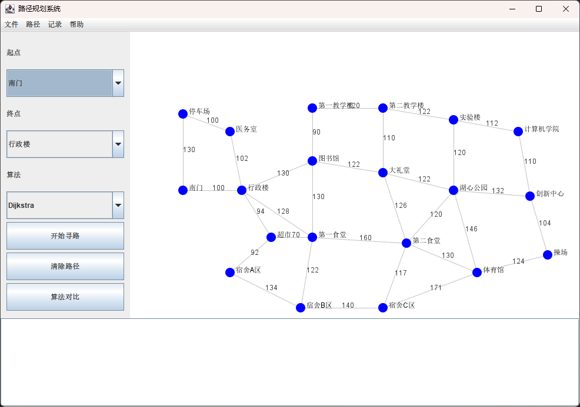
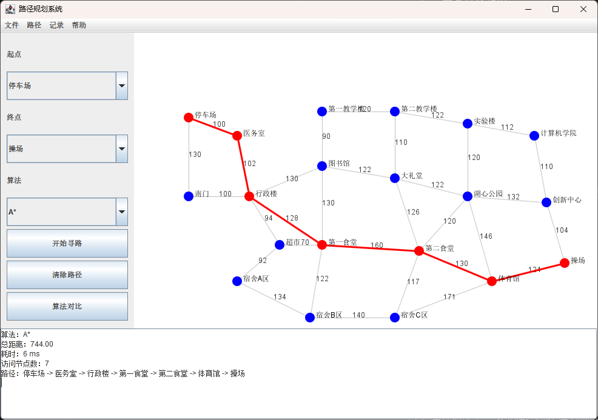
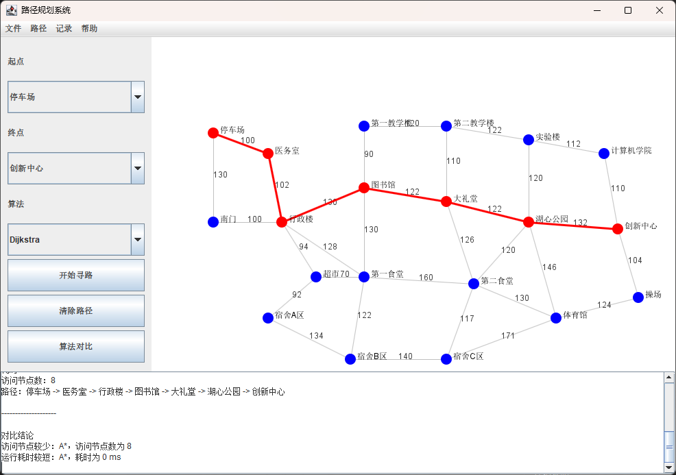
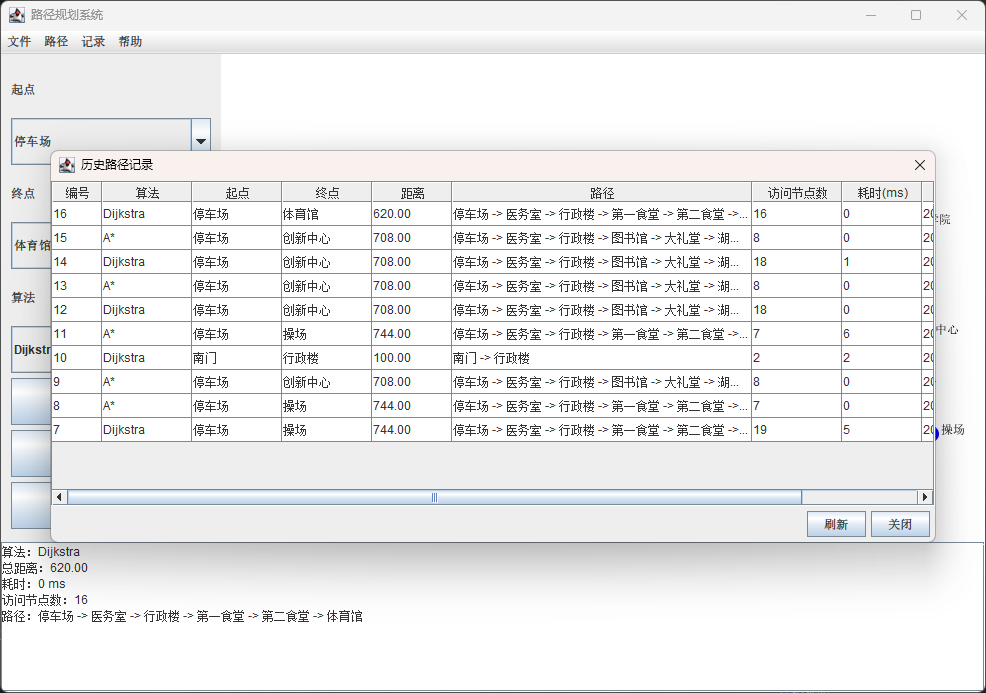
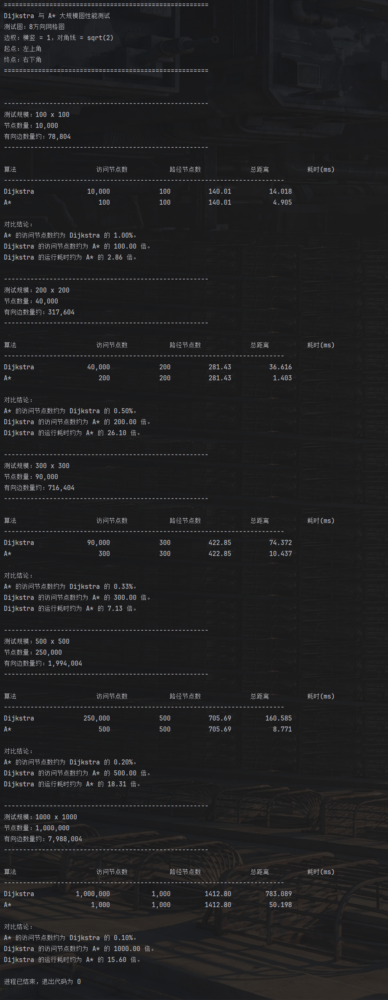

# PathPlanningSystem

基于 **Java Swing + SQLite** 的路径规划系统，支持在校园地图场景中进行最短路径查询、路径可视化、算法对比和查询记录持久化。

本项目主要实现了 **Dijkstra** 与 **A\*** 两种最短路径算法，并通过图形化界面展示路径搜索结果。同时，项目加入了 SQLite 数据库读写、历史查询记录、大规模 Benchmark 测试等功能，适合作为 Java 课程设计项目展示。

---

## 项目简介

PathPlanningSystem 将校园中的地点抽象为图中的节点，将道路抽象为带权边，使用邻接表存储地图结构。用户可以在图形界面中选择起点、终点和寻路算法，系统会计算最短路径，并在地图中高亮显示最终路径。

项目支持：

- Dijkstra 最短路径算法
- A\* 启发式搜索算法
- 校园地图可视化
- 路径高亮显示
- 算法运行结果展示
- Dijkstra 与 A\* 算法对比
- SQLite 地图数据持久化
- 路径查询历史记录保存与查看
- 大规模网格图性能测试

---

## 技术栈

| 类型 | 技术 |
|---|---|
| 开发语言 | Java |
| 图形界面 | Java Swing |
| 数据库 | SQLite |
| 数据库连接 | SQLite JDBC |
| JDBC 依赖 | sqlite-jdbc-3.53.2.0.jar |
| 核心算法 | Dijkstra、A\* |
| 图结构 | 邻接表 |
| 常用数据结构 | HashMap、LinkedHashMap、PriorityQueue、ArrayList |
| 开发工具 | IntelliJ IDEA |
| 版本管理 | Git、GitHub |

---

## 功能特性

### 路径查询

用户可以选择起点、终点和算法，系统会计算最短路径，并显示：

- 使用算法
- 路径总距离
- 运行耗时
- 访问节点数
- 完整路径

### 地图可视化

系统使用 Java Swing 绘制校园地图，包括：

- 地点节点
- 道路边
- 道路权重
- 最短路径高亮

### 算法对比

系统支持同时运行 Dijkstra 和 A\*，并对比两种算法的：

- 最短距离
- 访问节点数
- 运行耗时
- 最终路径

### 数据库持久化

系统使用 SQLite 保存地图数据和路径查询记录。

数据库文件：

```text
campus_path.db
```

主要数据表：

| 表名 | 作用 |
|---|---|
| nodes | 保存地图节点 |
| edges | 保存道路边 |
| path_records | 保存路径查询历史记录 |

### Benchmark 性能测试

项目额外提供大规模图测试模块，用于体现 Dijkstra 与 A\* 在大规模地图上的性能差异。

测试图为八方向网格图：

- 横向、纵向边权为 1
- 对角线边权为 sqrt(2)
- 起点为左上角
- 终点为右下角
- A\* 使用欧几里得距离作为启发函数

默认测试规模包括：

```text
100 x 100
200 x 200
300 x 300
500 x 500
1000 x 1000
```

---

## 项目结构

## 项目结构

```text
PathPlanningSystem
├── src
│   └── main
│       ├── Main.java
│       │
│       ├── algorithm
│       │   ├── PathAlgorithm.java
│       │   ├── AbstractSearchAlgorithm.java
│       │   ├── Dijkstra.java
│       │   └── AStar.java
│       │
│       ├── benchmark
│       │   ├── AlgorithmBenchmarkMain.java
│       │   └── BenchmarkGraphFactory.java
│       │
│       ├── database
│       │   ├── DBUtil.java
│       │   ├── GraphDao.java
│       │   └── RecordDao.java
│       │
│       ├── model
│       │   ├── Node.java
│       │   ├── Edge.java
│       │   ├── Graph.java
│       │   └── PathResult.java
│       │
│       ├── service
│       │   └── RouteService.java
│       │
│       └── ui
│           ├── MainFrame.java
│           ├── MapPanel.java
│           ├── ControlPanel.java
│           ├── ResultPanel.java
│           └── RecordDialog.java
│
├── lib
│   └── sqlite-jdbc-3.53.2.0.jar
│
├── images
│   ├── cover.webp
│   ├── main-ui.webp
│   ├── path-result.webp
│   ├── algorithm-compare.webp
│   ├── history-record.webp
│   └── benchmark-result.webp
│
├── PathPlanningSystem.iml
├── README.md
└── LICENSE
```

---

## 核心设计

### 图结构设计

项目使用 `Graph` 类存储地图结构，其中节点使用 `Node` 表示，道路使用 `Edge` 表示。

图结构采用邻接表：

```text
节点编号 -> 从该节点出发的所有边
```

这种方式适合校园道路这类稀疏图场景，相比邻接矩阵更节省空间。

### 算法设计

项目通过 `PathAlgorithm` 接口统一不同路径算法的调用方式。

```java
public interface PathAlgorithm {
    PathResult findPath(Graph graph, int startId, int endId);

    String getName();
}
```

Dijkstra 和 A\* 具有大量相同的搜索逻辑，因此项目将公共部分抽象到 `AbstractSearchAlgorithm` 中。

Dijkstra 可以看作启发函数为 0 的 A\*：

```java
// Dijkstra
h(n) = 0
```

A\* 使用欧几里得距离作为启发函数：

```java
// A*
h(n) = sqrt((x1 - x2)^2 + (y1 - y2)^2)
```

这样既减少了重复代码，也让两种算法之间的关系更加清晰。

### 数据库设计

系统启动时会自动初始化 SQLite 数据库。

启动流程大致如下：

```text
启动程序
↓
初始化数据库
↓
如果 nodes 表为空，插入默认校园地图
↓
从 nodes / edges 表读取数据
↓
构造 Graph 对象
↓
创建 RouteService
↓
打开 Swing 主窗口
```

---

## 运行方式

### 1. 克隆仓库

```bash
git clone https://github.com/TheSnowWolf/PathPlanningSystem.git
cd PathPlanningSystem
```

### 2. 使用 IntelliJ IDEA 打开项目

当前项目以 IntelliJ IDEA 项目结构组织，可以直接使用 IDEA 打开仓库目录。

### 3. 添加 SQLite JDBC 依赖

项目需要 SQLite JDBC 驱动。如果使用 IDEA，可以将 `sqlite-jdbc.jar` 添加到项目依赖中。

如果后续改为 Maven 项目，可以添加类似依赖：

```xml
<dependency>
    <groupId>org.xerial</groupId>
    <artifactId>sqlite-jdbc</artifactId>
    <version>3.46.1.0</version>
</dependency>
```

### 4. 运行主程序

运行入口：

```text
src/main/Main.java
```

主类：

```text
main.Main
```

### 5. 运行 Benchmark 测试

运行入口：

```text
src/main/benchmark/AlgorithmBenchmarkMain.java
```

也可以指定测试规模：

```bash
AlgorithmBenchmarkMain 500 500
```

---

## 使用说明

1. 启动程序后，系统会显示校园地图；
2. 在左侧控制面板选择起点；
3. 选择终点；
4. 选择 Dijkstra 或 A\* 算法；
5. 点击“开始寻路”；
6. 地图中会高亮显示最短路径；
7. 底部结果区会显示路径、距离、耗时和访问节点数；
8. 点击“算法对比”可以同时比较 Dijkstra 与 A\*；
9. 点击菜单栏“记录 -> 查看历史记录”可以查看历史查询；
10. 点击菜单栏“文件 -> 保存地图到数据库”可以保存当前地图数据。

---

## 依赖说明

本项目使用 SQLite 作为本地数据库，需要 SQLite JDBC 驱动支持。

当前项目使用的依赖文件为：

```text
lib/sqlite-jdbc-3.53.2.0.jar
```


## 项目截图

### 主界面



### 路径查询结果



### 算法对比结果



### 历史路径记录



### Benchmark 测试结果



---

## 开发记录

项目主要提交内容包括：

```text
初始化项目
已完成基础建图
已完成 Dijkstra 寻路
已完成 A*，使用 Service 统一调用算法，将 Dijkstra 与 A* 公共模板合并为父类
完成基础 UI
实现路径清除和算法对比
实现 SQLite-JDBC 读写数据库，更大型的测试数据
添加路径查询记录保存
支持路径查询历史记录的保存和查询，清理菜单栏内容
修复负权边、有向图问题，改进地图渲染
添加 benchmark 大规模数据算法比对，引入 SwingWorker 多线程
修正 IDEA 中的警告
```

---

## 项目亮点

### 1. Dijkstra 与 A\* 共用算法模板

项目将搜索过程中的公共逻辑抽象到父类中，避免两种算法重复实现优先队列、距离表、路径回溯等代码。

### 2. 支持图形化路径展示

相比纯控制台输出，Swing 图形界面可以更加直观地展示地图结构和最短路径。

### 3. 支持算法对比

系统可以同时运行 Dijkstra 和 A\*，并对比访问节点数和运行耗时，方便观察启发函数对搜索效率的影响。

### 4. 支持 SQLite 持久化

地图节点、道路和历史查询结果都可以保存到本地数据库，增强了系统的完整性。

### 5. 使用 SwingWorker 优化界面响应

寻路和算法对比任务通过 `SwingWorker` 在后台线程中执行，避免大规模图测试时阻塞 Swing 界面。

### 6. 提供大规模 Benchmark 测试

项目使用八方向网格图生成测试数据，可以更明显地体现 A\* 相比 Dijkstra 的搜索效率优势。

---

## 后续改进方向

- 支持用户在界面中新增、删除和拖动节点；
- 支持用户手动添加道路和修改边权；
- 增加 Floyd、BFS、Bellman-Ford 等更多算法；
- 支持障碍物或不可通行道路设置；
- 支持导入真实地图数据；
- 优化界面样式；
- 增加路径动画演示；
- 将桌面端项目扩展为 Web 版本。

---

## License

本项目采用 MIT License 开源协议，详细内容请查看 [LICENSE](./LICENSE) 文件。
